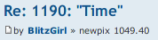
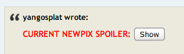

User scripts for the Waiters of Time, the One True Comic
========================================================

These scripts enhance the wonderful experience of Waiters by tweaking some bits
of the pages of the One True Thread.

Wtf is that?
------------

Oh, you don't know about the One True Comic? But... What are you doing here?!

Don't worry, you can still be part of the experience. The One True Comic is
Time, the [xkcd #1190](http://xkcd.com/1190/). The image you see updates every
hour, and the successive frames tell a story.

This comic have gathered a whole community - no, a whole culture ! - talking in
the [One True Thread](http://forums.xkcd.com/viewtopic.php?f=7&t=101043).

You can find more on the Thread itself, or in the dedicated
[wiki](http://xkcd-time.wikia.com/wiki/XKCD_Time_Wiki).

The Scripts
-----------

 * Newpix convertor: converts those old heretic message dates into the One Time
   Unit, the newpix.
 * Spoiler detector: detects whenever the dynamic link to the current image is
   posted on the thread.

I also plan on writing a third script allowing users to quote multiple messages
easily.

Installation
------------

Firefox : be sure to have
[Greasemonkey](https://addons.mozilla.org/firefox/addon/greasemonkey/) installed
and click on [this link](http://88.191.116.37/xkcd/timescripts.user.js). This
will download all three scripts.

Chrome : install [Tampermonkey](http://tampermonkey.net/) and install each
script separately.

Firefox and Chrome : to install each script separately, you can use these links.
 * [Newpix convertor](http://88.191.116.37/xkcd/newpix-convertor.user.js)
 * [Spoiler detector](http://88.191.116.37/xkcd/spoiler-detector.user.js)

Gallery
-------

